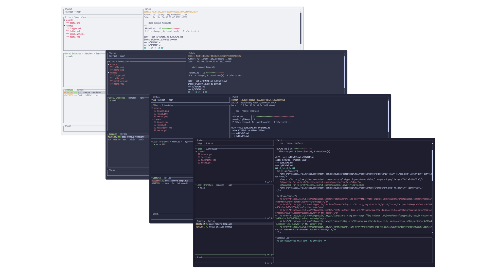
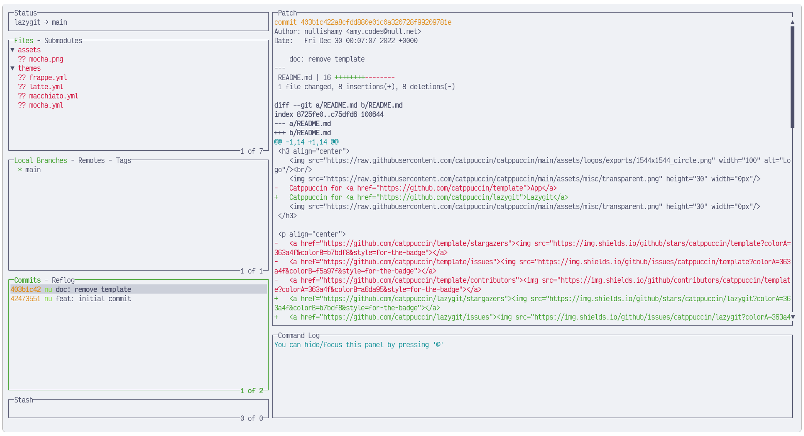
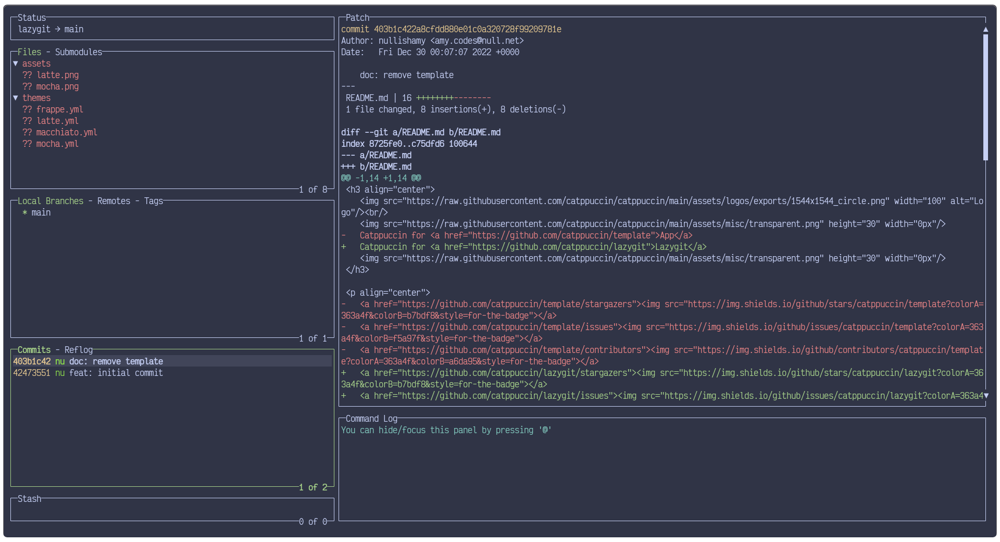
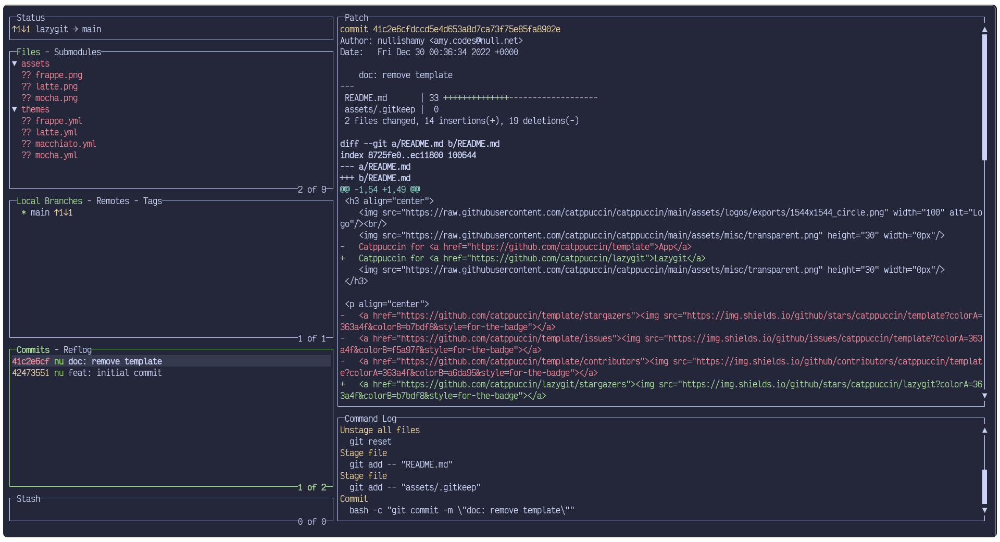
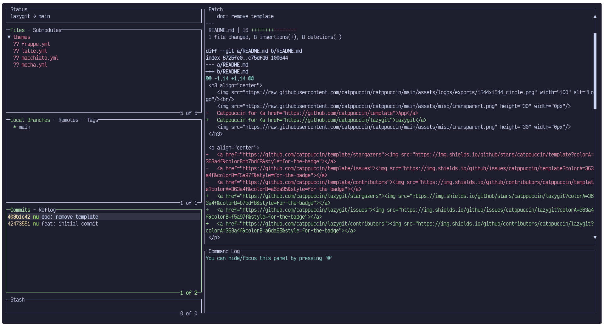

<h3 align="center">
	<br/>
	
	Catppuccin for <a href="https://github.com/jesseduffield/lazygit">Lazygit</a>
	
</h3>

<p align="center">
	<a href="https://github.com/catppuccin/lazygit/stargazers"></a>
	<a href="https://github.com/catppuccin/lazygit/issues"></a>
	<a href="https://github.com/catppuccin/lazygit/contributors"></a>
</p>

<p align="center">
	
</p>

## Previews

<details>
<summary>🌻 Latte</summary>

</details>
<details>
<summary>🪴 Frappé</summary>

</details>
<details>
<summary>🌺 Macchiato</summary>

</details>
<details>
<summary>🌿 Mocha</summary>

</details>

## Installation

### Finding your config directory
Lazygit respects XDG (for macOS and Linux), and uses AppData on Windows. So, below are the default config directories:
- Linux: `~/.config/lazygit/config.yml`
- MacOS: `~/Library/Application Support/lazygit/config.yml`
- Windows: `%APPDATA%\lazygit\config.yml`

If you cannot find the config files there, or your changes are not taking effect, you can ask lazygit itself for the config directory:
```sh
lazygit --print-config-dir
```
Keep this directory in mind for all future steps, replacing `<config-dir>` when relevant.

### Apply the theme
1. Clone this repository locally
2. Ensure the config directory exists. If it doesn't, you can run `lazygit` to launch and setup the directory.

At this point, you will have to decide how you want to load the theme.

You can either copy it straight into your `config.yml` file, or 
add flags to lazygit which will merge it from our presets.


#### If you want to merge with your own config: 
1. Choose the flavor you want (from `./themes`)
2. Choose the accent you want from within the flavor directory.
3. Replace the `theme` section of `<config-dir>/config.yml` with the theme you want to use (from `themes`).

    For example, if you want to use the catppuccin **mocha** theme, with the **blue** accent, then copy the contents of [`themes/mocha/blue.yml`](./themes/mocha/blue.yml) and paste them directly into your lazygit `config.yml` as follows:
    <details>
    <summary>config.yml</summary>

    ```yaml
    gui:
     # Use the mocha catppuccin theme
     theme:
       activeBorderColor:
         - '#89b4fa'
         - bold
       inactiveBorderColor:
         - '#a6adc8'
       optionsTextColor:
         - '#89b4fa'
       selectedLineBgColor:
         - '#313244'
       selectedRangeBgColor:
         - '#313244'
       cherryPickedCommitBgColor:
         - '#45475a'
       cherryPickedCommitFgColor:
         - '#89b4fa'
       unstagedChangesColor:
         - '#f38ba8'
       defaultFgColor:
         - '#cdd6f4'
       searchingActiveBorderColor:
         - '#f9e2af'
    ```
    </details>
4. Close and re-open lazygit to see your new theme!

#### If you want to use our preset:	
1. Choose the flavor you want (from `./themes-mergable/`)
2. Choose the accent you want from within the flavor directory.
3. Copy your chosen theme file into `<config-dir>/lazygit` 
4. Change your lazygit startup command (you may want to set a shell alias) to the following:
```bash
# This will instruct lazygit to open both config files, merge them, and then boot.
# You can add more config files, delimited by a comma, to this list

# Replacing <your-theme> with the relevant theme file
lazygit --use-config-file="<config-dir>/config.yml,<your-theme>.yml"
# or
LG_CONFIG_FILE="<config-dir>/config.yml,<your-theme>.yml" lazygit
```

5. Close and re-open lazygit to see your new theme!

## 🙋 FAQ

- Q: **_"Why is the background wrong?"_**\
  A: Lazygit uses your terminal background. You should set it to the relevant background
  for your theme.

## 💝 Thanks to

- [nullishamy](https://github.com/nullishamy)

&nbsp;

<p align="center">
	
</p>

<p align="center">
	Copyright &copy; 2021-present <a href="https://github.com/catppuccin" target="_blank">Catppuccin Org</a>
</p>

<p align="center">
	<a href="https://github.com/catppuccin/lazygit/blob/main/LICENSE"></a>
</p>
